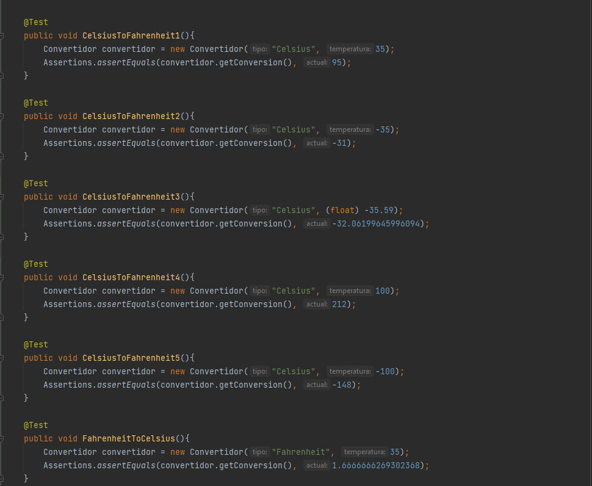
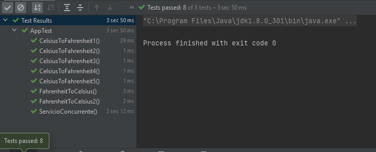
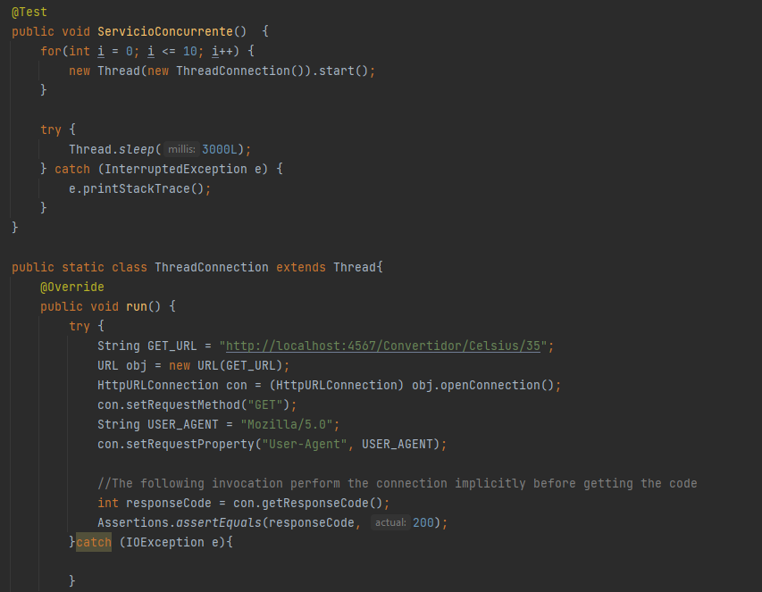
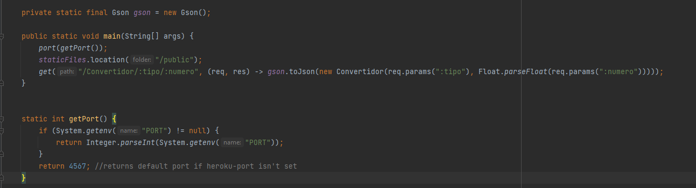
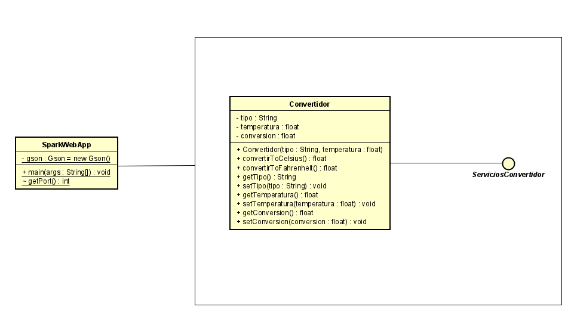
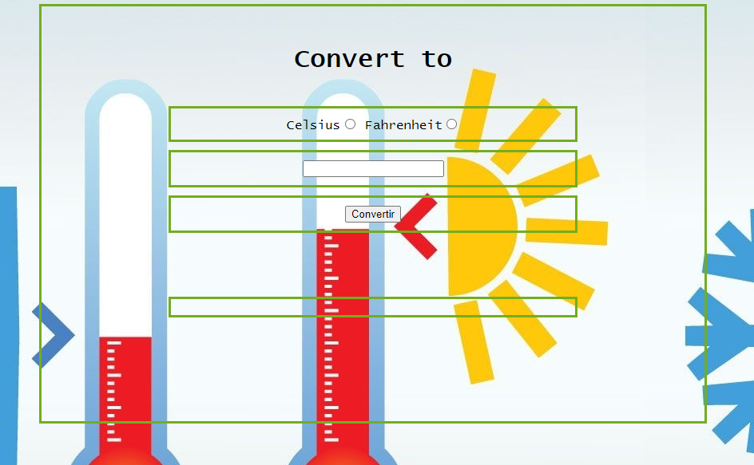
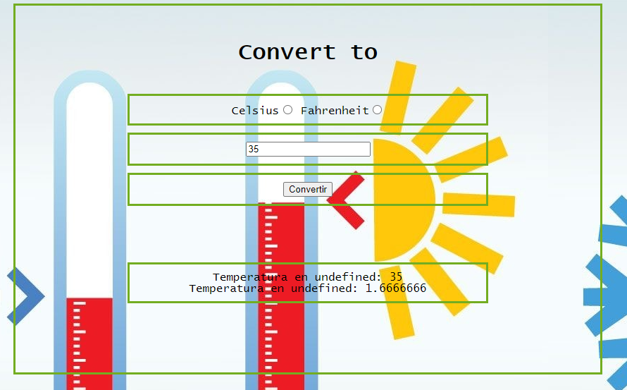
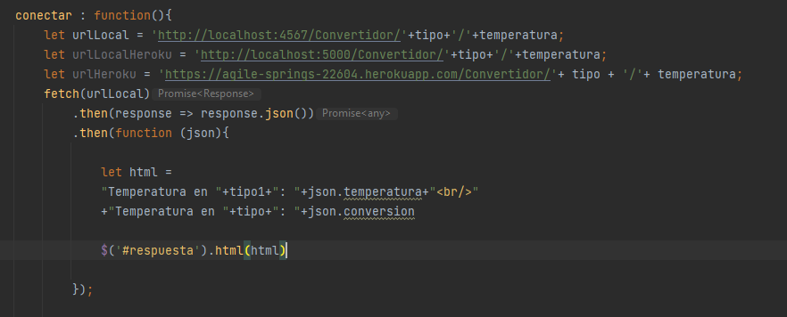

# INTRODUCCIÓN MVN-GIT Y HEROKU

### Autor: Edward Daniel Porras Martin

### Despliegue Heroku

### Prerequisitos

Para la ejecucion de la aplicacion de manera local se nesecita:

- Java 8
- Maven
- git

### Instalación

- Se debe clonar el proyecto desde la consola de la maquina 
`git clone https://github.com/Daniel19902/AREP-LAB1.git`

- Entrar a la carpeta clonada `cd AREP-LAB1`

- Se debe ejecutar un comando de Maven para comprobar el funcionamiento `mvn package`

# Ejecución

### Linux
`java -cp target/classes:target/dependency/* edu.escuelaing.arem.SparkWebApp`

### Windows

`java -cp target/classes;target/dependency/* edu.escuelaing.arem.SparkWebApp`

### Pruebas

Se realizaron varias pruebas para comprobar el buen funcionamiento de la convercion de celsius a Fahrenheit y viceversa

Tambien se hicieron pruebas remotas concurrentes

## Arquitectura

La arquitectura implementada fue cliente-servidor en donde se tiene un cliente web el cual consume
un Api Rest construido con spark. como sabemos este patron proporciona servicios a los clientes donde
se piden peticiones rest atravez del protocolo https o http. En este proyecto de pasar de celsius a Fahrenheit
y viseversa se creo un peticion get el cual retorna un Json con la converción.

Una vez se recibe la peticion se crea una clase de conversion el cual implementa una interzas de servicios

La clase SparkWebApp consume el servicio de convercion para poder retornar el JSON con la convercion

## Cliente

Para el cliente se implemento una interfaz amigable para poder hacer las peticiones de convercion

En el cual se escoge el tipo en el cual se quiere convertir y se da el numero a convertir

Para realizar la coneccion al API rest se establecio un js para poder realizar las peticiones

Con esto podemos consumir el API y poder hacer la peticiones de convercion

# Atributos de calidad

### Usabilidad 

Para medir la usabilidad del API se realiza una prueba en el cual se creo un hilo para pedir varias
peticiones(10) al servidor.

# Limitaciones

Una de las limitaciones de la arquitectura de cliente servidor es que es muy costos el mantenimiento
y mantenerlos debido que para poder resivir varias peticiones se usa muchos recursos de parte de la maquina
por lo que se tiene que tener maquinas con mucha capacidad operativa.

Tambien otro de los problemas es si hay fallos en la red este empezara a tener fallos de rendimiento

## Licencias

En este proyecto se usó la licencia GNU - se puede ver [LICENSE.txt](LICENSE.txt) para más detalles.

